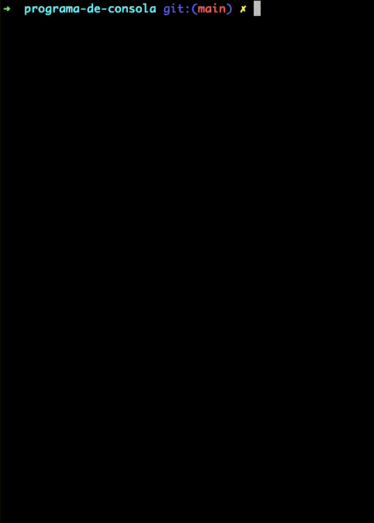

<h1 align="center">Node and JavaScript Reinforcement course</h1>

<b>
Creating console application with node
</b>

After downloading the repository, we go to the console program folder and open the terminal.
 
<b>npm i</b>
 
For the installation of node_modules: which contains the libraries to create the console App
 
to run the console app, use the 
 
<b>command node app.js</b>

<h3 align="center">information</h3>

 This course is about node and reinforcement and / or explanation of modern javascript.
  
 we can go buy and see it here in this link
  
  <a target="_blank" href="https://www.udemy.com/course/node-de-cero-a-experto">Ir al curso</a>

This repository contains information about

  <ul>
  <li>Async-await</li>
  <li>CallBack-hell</li>
  <li>Callbacks</li>
  <li>Const, var and let</li>
  <li>Funtion Flecha</li>
  <li>Promise</li>
  <li>Template string</li>

  </ul>

  

